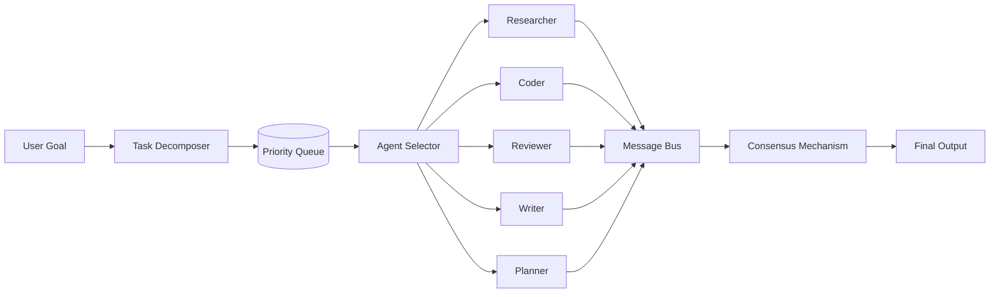
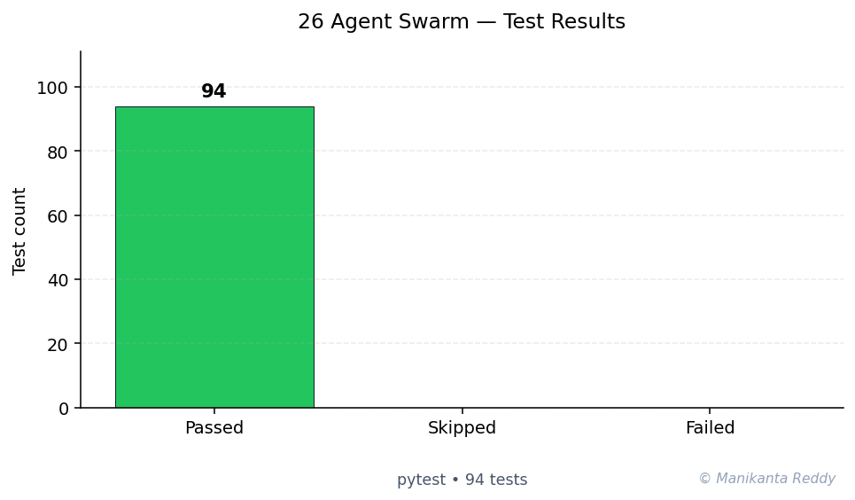

# Agent Swarm Task Delegation

[](https://www.python.org/)
[](LICENSE)
[](https://github.com/psf/black)
[](https://docs.pytest.org/)

> An intelligent multi-agent system that simulates task delegation among specialized agents using capability-based matching, consensus mechanisms, and adaptive load balancing.

## Overview

The **Intelligent Agent Swarm for Task Delegation** is a production-grade Python framework for building and orchestrating multi-agent systems. It features intelligent task routing, automatic decomposition, inter-agent messaging, consensus-driven decisions, and comprehensive performance tracking.

### Key Features

- **5+ Specialized Agent Types**: Researcher, Coder, Reviewer, Writer, Planner
- **Capability-Based Matching**: Match tasks to agents by required skills
- **Task Decomposition**: Automatically split complex tasks into subtasks
- **Multiple Selection Strategies**: Best-match, weighted, least-loaded, round-robin
- **Inter-Agent Messaging**: Pub/sub message bus for agent communication
- **Consensus Mechanism**: Collaborative voting for critical decisions
- **Retry with Backoff**: Automatic retry on failure with exponential backoff
- **Load Balancing**: Even distribution of work across agents
- **Performance Tracking**: Comprehensive metrics and bottleneck detection
- **Priority Queue**: Task scheduling by priority level
- **Thread-Safe**: All components use proper synchronization

## Architecture

```
                    +------------------+
                    |     CLI / API    |
                    +--------+---------+
                             |
                    +--------v---------+
                    |  Orchestrator    |
                    +--------+---------+
                             |
        +--------------------+--------------------+
        |                    |                    |
+-------v------+  +----------v----------+  +-----v--------+
| Task Queue   |  |   Agent Registry    |  | Message Bus  |
+-------+------+  +----------+----------+  +-----+--------+
        |                    |                    |
+-------v------+  +----------v----------+  +-----v--------+
| Decomposer   |  |  Agent Selector     |  |  Consensus   |
+--------------+  +---------------------+  +--------------+
                             |
                    +--------v---------+
                    |  Agent Swarm     |
                    +------------------+
```

See [docs/architecture.md](docs/architecture.md) for detailed architecture documentation.

## Tech Stack

| Component | Technology |
|-----------|-----------|
| Language | Python 3.10+ |
| CLI | Click + Rich |
| Logging | Structlog |
| Validation | Pydantic |
| Testing | pytest + pytest-asyncio |
| Code Quality | Black, mypy, flake8 |

## Installation

```bash
# Clone the repository
git clone https://github.com/example/agent-swarm.git
cd agent-swarm

# Create a virtual environment
python -m venv .venv
source .venv/bin/activate  # Linux/Mac
# .venv\Scripts\activate  # Windows

# Install dependencies
pip install -e ".[dev]"
```

### Requirements

```bash
pip install click rich pydantic structlog
```

For development:
```bash
pip install pytest pytest-asyncio pytest-cov black mypy flake8
```

## Usage

### Quick Start

```python
from src.orchestrator import SwarmOrchestrator
from src.agents.researcher import ResearcherAgent
from src.agents.coder import CoderAgent
from src.tasks.task import TaskPriority

# Create orchestrator
orch = SwarmOrchestrator()

# Register agents
orch.register_agent(ResearcherAgent("Alice"))
orch.register_agent(CoderAgent("Bob"))

# Start the swarm
orch.start()

# Submit tasks
orch.submit_task_simple(
    "Research AI adoption trends",
    task_type="research",
    priority=TaskPriority.HIGH,
)

orch.submit_task_simple(
    "Implement authentication module",
    task_type="code",
    priority=TaskPriority.HIGH,
)

# Wait for completion
orch.wait_for_empty(timeout=30)

# Get metrics
metrics = orch.get_metrics()
print(f"Completed: {metrics['swarm']['total_tasks_completed']}")

# Stop
orch.stop()
```

### Context Manager

```python
with SwarmOrchestrator() as orch:
    orch.register_agent(ResearcherAgent("Alice"))
    orch.submit_task_simple("Research task", "research")
    orch.wait_for_empty(timeout=30)
    # Automatically stops on exit
```

### CLI

```bash
# Run a simulation
python -m src.cli simulate --agents 2 --tasks 10 --strategy weighted --report

# Full simulation with all features
python -m src.cli simulate --agents 3 --tasks 20 --duration 10 --report
```

### Running Demo Scenarios

```python
from scenarios.demo_scenarios import DemoScenarios

# Run all scenarios
DemoScenarios.run_all()

# Or run individual scenarios
DemoScenarios.scenario_basic_delegation()
DemoScenarios.scenario_load_balancing()
DemoScenarios.scenario_task_decomposition()
DemoScenarios.scenario_consensus_mechanism()
DemoScenarios.scenario_retry_and_resilience()
DemoScenarios.scenario_full_swarm_simulation()
```

## Agent Types

| Agent | Type | Key Capabilities |
|-------|------|-----------------|
| **Researcher** | `researcher` | Information retrieval, analysis, web search |
| **Coder** | `coder` | Programming, debugging, testing, architecture |
| **Reviewer** | `reviewer` | Quality assurance, compliance, fact-checking |
| **Writer** | `writer` | Content creation, documentation, editing |
| **Planner** | `planner` | Strategy, scheduling, resource management |

## Configuration

### Orchestrator Options

```python
from src.orchestrator import SwarmOrchestrator

orch = SwarmOrchestrator(
    max_workers=20,              # Thread pool size
    auto_decompose=True,         # Enable task decomposition
    selection_strategy="weighted",  # Agent selection strategy
    enable_load_balancing=True,  # Enable load balancing
    retry_policy={
        "max_retries": 3,
        "backoff_factor": 2.0,
    },
)
```

### Selection Strategies

- `best_match`: Highest capability score
- `weighted`: Combined capability and load score (default)
- `least_loaded`: Prefers available agents
- `capability_then_load`: Capability-first with load tiebreaker
- `round_robin`: Even distribution
- `random`: Random selection

## Testing

```bash
# Run all tests
pytest

# Run with coverage
pytest --cov=src --cov-report=term-missing

# Run specific test file
pytest tests/test_orchestrator.py

# Run with verbose output
pytest -v
```

## Screenshots

> _Screenshots will be added here showing the CLI output and performance dashboards._

```
+--------------------------------------------------+
|            Agent Swarm Simulation                |
+--------------+--------------+---------------------+
| Metric       | Value        | Status              |
+--------------+--------------+---------------------+
| Completed    | 24           | [OK]                |
| Failed       | 1            | [WARN]              |
| Success Rate | 96.0%        | [OK]                |
| Queue Size   | 0            | [OK]                |
| Active       | 8            | [OK]                |
| Avg Load     | 12.5%        | [OK]                |
+--------------+--------------+---------------------+
```

## Project Structure

```
project_26_agent_swarm/
  src/
    __init__.py
    orchestrator.py        # Central swarm controller
    agent_registry.py      # Agent discovery and management
    task_decomposer.py     # Task breakdown engine
    agent_selector.py      # Agent selection strategies
    message_bus.py         # Inter-agent messaging
    consensus.py           # Voting and consensus
    performance.py         # Metrics and tracking
    cli.py                 # Command-line interface
    agents/
      __init__.py
      base_agent.py        # Abstract agent base class
      researcher.py        # Research agent
      coder.py             # Coding agent
      reviewer.py          # Review agent
      writer.py            # Writing agent
      planner.py           # Planning agent
    tasks/
      __init__.py
      task.py              # Task model
      task_queue.py        # Priority queue
  tests/
    __init__.py
    test_orchestrator.py
    test_agent_registry.py
    test_task_decomposer.py
    test_agent_selector.py
    test_message_bus.py
    test_consensus.py
  scenarios/
    demo_scenarios.py      # Demo scenarios
  docs/
    architecture.md        # Architecture docs
  requirements.txt
  pyproject.toml
  setup.py
  README.md
  LICENSE
```

## Future Improvements

1. **Dynamic Agent Scaling**: Auto-create agents based on workload
2. **ML-Based Selection**: Train models for optimal agent-task matching
3. **Persistent State**: Save/restore swarm state across restarts
4. **Distributed Mode**: Support multi-node deployments
5. **Web Dashboard**: Real-time monitoring with Streamlit/Dash
6. **Plugin System**: Third-party agent and strategy extensions
7. **A2A Protocol**: Google's Agent-to-Agent protocol support
8. **Event Sourcing**: Full audit trail for all decisions
9. **Graph Visualization**: Visualize agent-task relationships
10. **REST API**: HTTP interface for remote control

## Contributing

1. Fork the repository
2. Create a feature branch (`git checkout -b feature/amazing-feature`)
3. Commit your changes (`git commit -m 'feat: add amazing feature'`)
4. Push to the branch (`git push origin feature/amazing-feature`)
5. Open a Pull Request

## License

This project is licensed under the MIT License - see the [LICENSE](LICENSE) file for details.

---

<!-- showcase:start -->

## Architecture



## Test Results



**94 passing**, **0 failing**, **0 skipped** (total 94, framework: pytest)

## References & Further Reading

- Wooldridge, M. (2009). *An Introduction to MultiAgent Systems* (2nd ed.). Wiley.
- Stone, P. & Veloso, M. (2000). *Multiagent Systems: A Survey from a Machine Learning Perspective.* Autonomous Robots 8(3). [↗](https://link.springer.com/article/10.1023/A:1008942012299)

## Author

**Manikanta Reddy Mandadhi** — Senior Data Scientist (RAG / Agentic AI)

GitHub: [@Mani9006](https://github.com/Mani9006/intelligent-agent-swarm) · LinkedIn: [reddy1999](https://www.linkedin.com/in/reddy1999) · Portfolio: [manikantabio.com](https://www.manikantabio.com)

<!-- showcase:end -->
